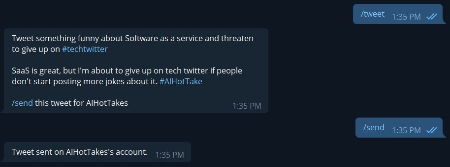

# Responsible AI Hot Takes

Generate and tweet awesome #techtwitter content with OpenAI via Telegram.

After following [FireShipIO's tutorial](https://github.com/fireship-io/gpt3-twitter-bot/) and hearing of OpenAI's new Twitter bot policy, I decided to create a slightly less automatic way to run a AI-backed Twitter bot.

Instead of the bot automatically Tweeting, it will instead send the user potential options before you settle on the final result.

Check out my bot here: [@AIHotTakes](https://twitter.com/AIHotTakes)